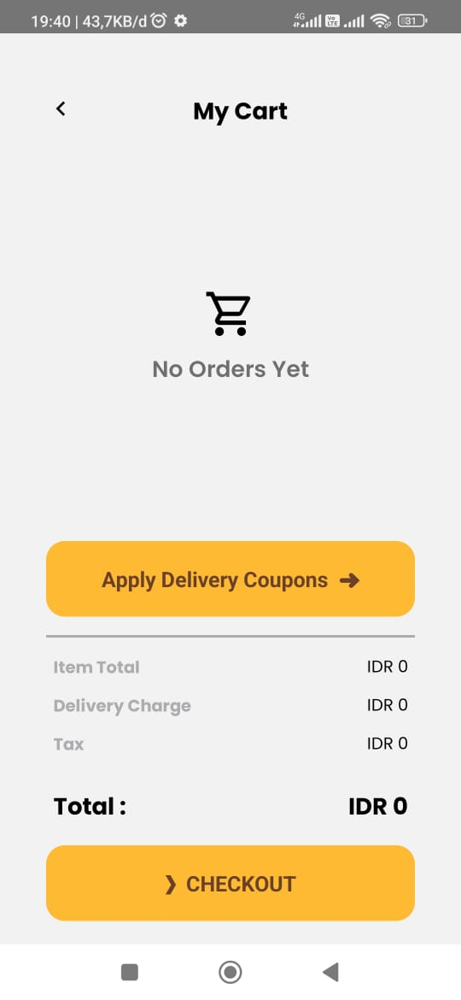

<a id="readme-top"></a>

<!-- PROJECT LOGO -->
<br />
<div align="center">
  <a href="#">
    
  </a>

  <h2 align="center">Coffee Shop Mobile App</h2>

  <p align="center">
    <a href="https://drive.google.com/drive/folders/14oZFRT4Qw-UtfLaGxEpNu46aX73j7HRq?usp=sharing">View Demo</a>
    ·
    <a href="#">Report Bug</a>
    ·
    <a href="#">Request Feature</a>
  </p>
</div>

## Contents
- [About](#about-the-project)
- [Build With](#build-with)
- [Features](#features)
- [Run Application](#how-to-run-the-application)
- [Link Download](#download-link)
- [Related Projects](#related-projects)
- [Contributors](#contributors)

### Built With

- [![React][React.js]][React-url]
- [![Redux][Redux]][Redux-url]


<!-- <p align="right">(<a href="#readme-top">back to top</a>)</p> -->


## Features

### Customer

- Auth
  - Login
  - Logout
- User
  - Register
  - Forgot Password
  - Edit Profile
- Product
- Promo
- Transaction

### Admin

- Auth
  - Login
  - Logout
- User
  - Forgot Password
- Product
  - Add Product
  - Edit Product
- Promo
  - Add Promo
  - Edit Promo
- Transaction
  - Edit Transaction


## How to Run the Application

### 1. Clone this repository

Clone this repository by run the following code:

```
$ git clone https://github.com/yanu-setiawan/Coffee-Shop-Mobile.git

```

### 2. Install dependency packages

Install dependency packages by run the following code inside project folder:

```
$ npm install
```

### 3. Configure .env file

Configure .env file by create file named .env inside project folder and add this line to the file:

```
REACT_NATIVE_SERVER_HOST = https://example.com

```


### 4. Running app

1.  Start Metro

    ```
    npx react-native start
    ```

2.  Start app

    ```
    npx react-native run-android
    ```


## Link Download

[Download APP](https://drive.google.com/drive/folders/14oZFRT4Qw-UtfLaGxEpNu46aX73j7HRq?usp=sharing)

<p align="right">(<a href="#readme-top">back to top</a>)</p>

## Contributing


1. Fork the Project
2. Create your new Branch ( `git checkout -b ...` )
3. Commit your Changes ( `git commit -m '...'` )
4. Push to the Branch ( `git push origin ...` )
5. Open a Pull Request


<p align="right">(<a href="#readme-top">back to top</a>)</p>


<p align="right">(<a href="#readme-top">back to top</a>)</p>

## Documentation

<p align="center">





</p>

## Related Projects

[Coffee-Shop Website](https://github.com/yanu-setiawan/Coffee-Shop-React-App)

[Coffee-Shop Backend](https://github.com/yanu-setiawan/Coffee-Shop-Backend)

<p align="right">(<a href="#readme-top">back to top</a>)</p>


## License

This project is licensed under the ISC License. See the [LICENSE](LICENSE) file for details.

## Report Bug

Any error report you can pull request
or contact: <yanusetiawan363@gmail.com>


<p align="center"> <samp><i>&copy; yanusetiawan </i></samp> </p>

[Next.js]: https://img.shields.io/badge/next.js-000000?style=for-the-badge&logo=nextdotjs&logoColor=white
[Next-url]: https://nextjs.org/
[React.js]: https://img.shields.io/badge/React-20232A?style=for-the-badge&logo=react&logoColor=61DAFB
[React-url]: https://reactnative.dev/
[Tailwind-CSS]: https://img.shields.io/badge/tailwindcss-%2338B2AC.svg?style=for-the-badge&logo=tailwind-css&logoColor=white
[Tailwind-url]: https://tailwindcss.com/
[Redux]: https://img.shields.io/badge/redux-%23593d88.svg?style=for-the-badge&logo=redux&logoColor=white
[Redux-url]: https://redux.js.org/
